# Demand Planning AI

Demand Planning AI; geçmiş satışlardan mağaza–ürün seviyesinde talep tahmini
üreten, gelecek sevkiyat planını stok yeterliliği açısından simüle eden ve
stok açığı, fazla stok, servis seviyesi, kayıp satış, transfer ve ek sevkiyat
önerileri sunan Streamlit tabanlı bir karar destek uygulamasıdır.

Uygulamanın temel sorusu şudur:

> Tahmin edilen talep, mağazadaki mevcut stok ve planlanan sevkiyatlarla ne
> ölçüde karşılanabilir; hangi mağaza–ürünlere ne zaman müdahale edilmelidir?

Final gelecek tahmini yalnızca zero-shot zaman serisi modellerinden seçilir.
Naïve, sezonsal naïve ve hareketli ortalama yöntemleri karşılaştırma amacıyla
benchmark olarak kullanılır.

## Canlı demo

- Streamlit: `STREAMLIT_DEMO_LINKINI_BURAYA_EKLE`
- GitHub: `GITHUB_REPO_LINKINI_BURAYA_EKLE`

Repo ve uygulama bağlantılarını yayınladıktan sonra gizli sekmede test edin.

## Temel özellikler

- Geçmiş satış ve gelecek stok planı için ayrı dosya yükleme
- Esnek sütun eşleme ve veri kalitesi kontrolleri
- Stokta-yok dönemlerinde gözlenemeyen talebin düzeltilmesi
- Chronos Bolt Small, Chronos 2 ve opsiyonel TimesFM zero-shot tahmini
- WMAPE, Bias, MAE, RMSE ve benchmark iyileşmesi
- Validasyonda gerçek değer–model tahmini karşılaştırması
- Plan tarihleri için beklenen satış ve stok projeksiyonu
- Güvenlik stoğu, servis seviyesi ve stok tükenme tarihi
- Kayıp talep, kayıp satış değeri ve fazla stok analizi
- Depo tahsisi ve mağazalar arası transfer önerileri
- ABC–XYZ önceliklendirme ve insan inceleme sırası
- Talep, sevkiyat, gecikme ve servis seviyesi senaryoları
- Manuel tahmin düzenleme ve gerçekleşen veri sonrası FVA
- HTML yönetim özeti, Excel operasyon dosyası ve analitik ZIP çıktısı

## Önerilen kullanım akışı

```text
Veri Yükleme
    ↓
Veri Kalitesi Kontrolü
    ↓
Talep Tahmini ve Stok Simülasyonu
    ↓
Tahmin Performansı Kontrolü
    ↓
Stok Riskleri ve Dağıtım Önerileri
    ↓
ABC–XYZ / Senaryo / Manuel Düzeltme
    ↓
Raporlama ve Dışa Aktarım
```

İlk kullanımda sırasıyla **Veri Yükleme**, **Veri Kalitesi**, **Talep
Tahmini** ve **Tahmin Performansı** sayfalarını tamamlayın. Stok ve dağıtım
sayfaları, talep tahmini çalıştırıldıktan sonra anlamlı sonuç üretir.

## Ekran görüntüsü hazırlama rehberi

Ekran görüntülerini `docs/screenshots/` klasörüne aşağıdaki adlarla ekleyin.
README içindeki görseller otomatik olarak görünür hale gelir.

| Sayfa | Dosya adı |
|---|---|
| Ana Sayfa | `01_ana_sayfa.png` |
| Veri Yükleme | `02_veri_yukleme.png` |
| Veri Kalitesi | `03_veri_kalitesi.png` |
| Talep Tahmini | `04_talep_tahmini.png` |
| Tahmin Performansı | `05_tahmin_performansi.png` |
| Stok Riskleri | `06_stok_riskleri.png` |
| Stok Dağıtım Önerileri | `07_stok_dagitim_onerileri.png` |
| Mağaza / Ürün Detayı | `08_magaza_urun_detayi.png` |
| ABC–XYZ Önceliklendirme | `09_abc_xyz.png` |
| Senaryo Analizi | `10_senaryo_analizi.png` |
| Manuel Düzeltme ve FVA | `11_manuel_duzeltme_fva.png` |
| Raporlar | `12_raporlar.png` |
| Model ve Veri Bilgileri | `13_model_veri_bilgileri.png` |

Tutarlı bir görünüm için ekran görüntülerini aynı tarayıcı genişliğinde,
tercihen 1440 px veya daha geniş olarak alın. Gerçek şirket verisi
kullanıyorsanız mağaza, ürün, fiyat ve ciro bilgilerini maskeleyin.

## Sayfa rehberi

### 1. Ana Sayfa

**Amaç:** Yöneticiye plan döneminin genel durumunu ve ilk müdahale edilmesi
gereken mağaza–ürünleri tek ekranda göstermek.

**Ne gösterir?**

- Gelecek dönem talebi ve toplam kullanılabilir stok
- Karşılanamayan talep ve kayıp satış riski
- Fazla stok değeri ve beklenen servis seviyesi
- Riskli mağaza–ürün sayısı ve seçilen modelin Bias değeri
- Talep–stok zaman çizelgesi, risk dağılımı ve kayıp satış waterfall grafiği
- En önemli 10 operasyon aksiyonu

**Nasıl yorumlanır?**

- Karşılanan talep çizgisi tahmini talebe yakınsa mevcut plan yeterlidir.
- Toplam stok yeterli görünmesine rağmen karşılanamayan talep varsa sorun
  toplam stok miktarından çok stokun yanlış mağazada veya yanlış tarihte
  bulunması olabilir.
- Pozitif Bias modelin toplamda yüksek, negatif Bias düşük tahmin eğilimini
  gösterir.
- En önemli aksiyonlar tablosu günlük operasyon toplantısının başlangıç
  listesi olarak kullanılmalıdır.

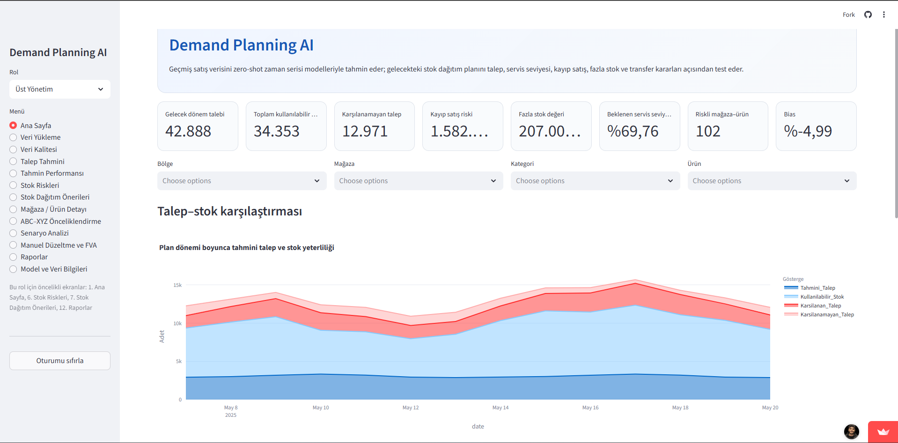

### 2. Veri Yükleme

**Amaç:** Geçmiş satış verisini ve gelecekte planlanan stok/sevkiyat dosyasını
ortak bir analitik şemaya dönüştürmek.

**Ne yapılır?**

- CSV, XLSX veya Parquet biçimindeki iki dosya yüklenir.
- Tarih, mağaza, ürün, satış ve stok gibi zorunlu alanlar eşlenir.
- Fiyat, kategori, bölge, promosyon, tedarik süresi, maliyet ve stokout gibi
  opsiyonel alanlar tanımlanır.
- Veri frekansı, tekrarlı kayıt politikası, eksik tarih politikası ve stok
  zamanlaması seçilir.

**Nasıl yorumlanır?**

- Önizlemede tarih ve sayısal sütunların doğru okunduğunu kontrol edin.
- Günlük veri için frekansı `Günlük`, aylık veri için `Aylık` seçin.
- Stok sütununun gün başını mı gün sonunu mu temsil ettiğini doğru belirtin;
  yanlış seçim stokout ve kayıp satış hesaplarını bozar.
- Mağaza ve ürün kimliklerinin iki dosyada aynı formatta olması gerekir.

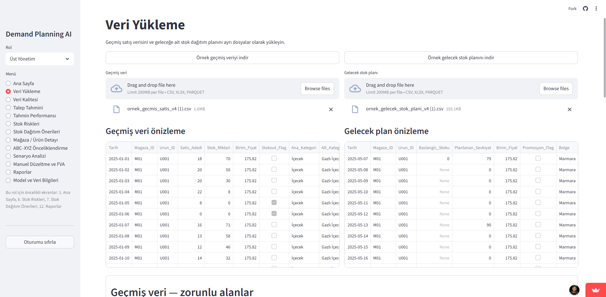

### 3. Veri Kalitesi

**Amaç:** Tahminden önce veri sorunlarını görünür hale getirmek ve satış ile
gerçek talep arasındaki farkı değerlendirmek.

**Ne gösterir?**

- Tarih aralığı ve mağaza–ürün sayısı
- Stokta-yok dönemlerinin sayısı
- Stokout nedeniyle düzeltilen tahmini kayıp talep
- Eksik, tekrarlı, negatif veya şüpheli kayıtlar
- Tahmin hatasına yol açabilecek veri kaynaklı nedenler

**Nasıl yorumlanır?**

- Stok olmadığı için satışın sıfır olması, gerçek talebin sıfır olduğu
  anlamına gelmez. Bu dönemler düzeltilmiş taleple modele aktarılır.
- Düzeltilen kayıp talep çok yüksekse geçmiş satışlar talebi sistematik olarak
  düşük gösteriyor olabilir.
- Çok sayıda eksik tarih veya yeni ürün bulunması model karşılaştırmasını daha
  az güvenilir hale getirir.
- Kritik veri sorunları düzeltilmeden tahmin sonucuna operasyonel karar
  bağlanmamalıdır.

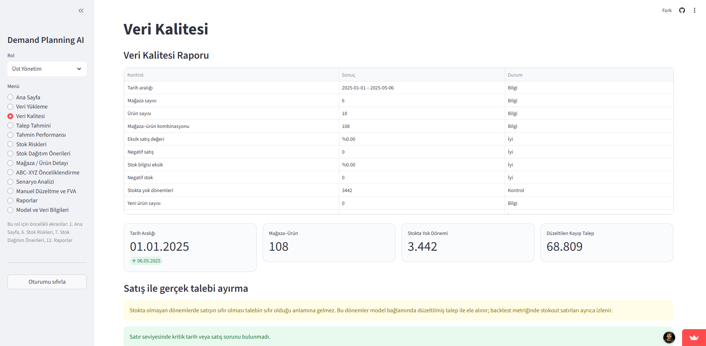

### 4. Talep Tahmini

**Amaç:** Zero-shot modelleri validasyonda karşılaştırmak, en başarılı modeli
seçmek ve gelecek stok planını bu tahmine göre simüle etmek.

**Kontroller:**

- **Zero-shot modeller:** Karşılaştırılacak final model adayları
- **Backtest ufku:** Geçmişin validasyon için ayrılan son dönem sayısı
- **Minimum geçmiş:** Bir serinin modele alınması için gereken en az dönem
- **Güvenlik stoğu dönemi:** Ortalama dönem talebinin kaç katının tampon stok
  olarak tutulacağı
- **Minimum servis seviyesi:** Önerilen stok planında hedeflenen talep karşılama
  oranı

Mevcut uygulamada güvenlik stoğu basitçe hesaplanır:

```text
Güvenlik stoğu = Tahmin ufkundaki ortalama dönem talebi × güvenlik stoğu dönemi
```

Günlük veride `1 dönem`, bir günlük ortalama talep kadar güvenlik stoğudur. Bu
hesap talep sapması ve tedarik süresinden türetilen istatistiksel güvenlik stoğu
formülü değildir; kullanıcı tarafından yönetilen operasyonel bir tampondur.

**Grafikler nasıl okunur?**

- Gri çizgi geçmiş gerçek satışları gösterir.
- Mor noktalı çizgi stokout etkisi düzeltilmiş geçmiş talebi gösterir.
- Kırmızı çarpılar stokta-yok dönemlerini işaretler.
- Turuncu çizgi gelecekte tahmin edilen talebi gösterir.
- Yeşil çizgi mevcut stok ve planlı sevkiyatla karşılanabilecek tahmini satıştır.
- Turuncu ile yeşil çizgi arasındaki fark stok nedeniyle satışa dönüşemeyecek
  taleptir.
- Sevkiyat grafiğinde mavi sütun planlı girişi, kırmızı sütun karşılanamayan
  talebi gösterir. Kırmızı sütunun sevkiyattan önce yükselmesi zamanlama
  problemine işaret eder.
- Stok projeksiyonunda dönem sonu stok güvenlik stoğunun altına düşüyorsa plan
  kırılgandır; sıfıra düşüyorsa doğrudan stokout riski vardır.

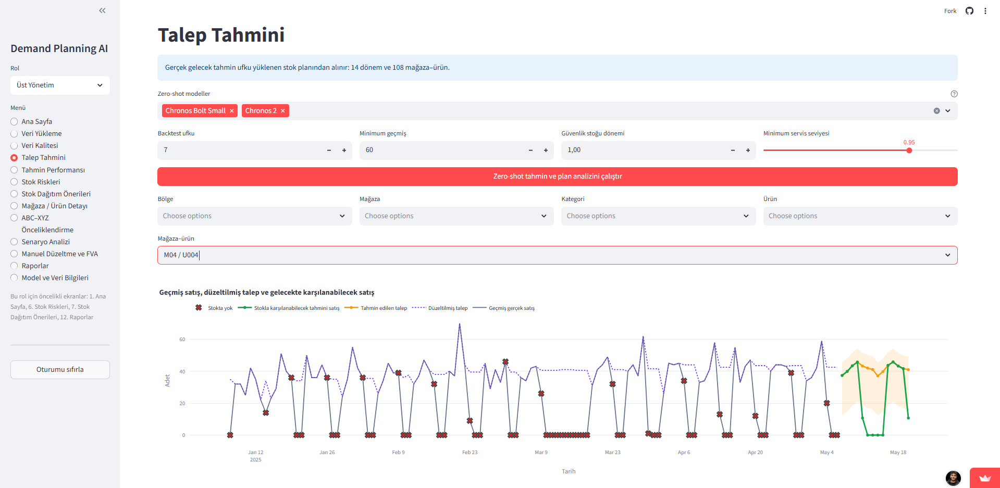

### 5. Tahmin Performansı ve Model Kalitesi

**Amaç:** Modelin validasyonda gerçek satışları ne kadar iyi tahmin ettiğini ve
hataların nerede yoğunlaştığını değerlendirmek.

**Ne gösterir?**

- Model bazında WMAPE, Bias, MAE, RMSE ve benchmark iyileşmesi
- Seçilen mağaza–ürün için gerçek değer–model tahmini grafiği
- Tarih bazında gerçek, tahmin, tahmin hatası ve mutlak hata tablosu
- Tahmin ufku ilerledikçe WMAPE ve Bias değişimi
- Bölge/mağaza ve kategori/hafta bazında hata ısı haritası
- Veri kalitesi ve talep davranışından türetilen olası hata nedenleri

**Nasıl yorumlanır?**

- WMAPE, MAE ve RMSE için düşük değer daha iyidir.
- Bias sıfıra yakın olmalıdır. Pozitif değer fazla, negatif değer eksik tahmin
  eğilimini gösterir.
- Benchmark iyileşmesinin pozitif olması, modelin basit referans yöntemlerden
  daha iyi sonuç verdiğini gösterir.
- Gerçek ve tahmin çizgileri birlikte hareket etmiyor veya tepe noktaları
  kaçırılıyorsa promosyon, stokout, fiyat veya takvim etkileri incelenmelidir.
- Ufuk büyüdükçe hata hızlı artıyorsa uzun dönem kararlarına daha yüksek tampon
  veya daha sık yeniden tahmin gerekir.
- Isı haritasındaki yüksek hatalı bölgeler genel metrikten bağımsız olarak
  ayrıca ele alınmalıdır.

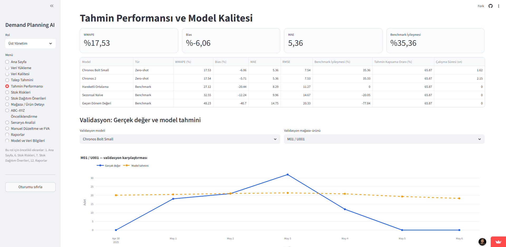

### 6. Stok Riskleri

**Amaç:** Plan döneminde stok açığı veya fazla stok oluşacak mağaza–ürünleri
belirlemek.

**Ne gösterir?**

- Toplam ihtiyaç, dağıtılabilir depo stoğu ve beklenen stok açığı
- Fazla stok, servis seviyesi ve kurtarılabilir satış değeri
- Tarih bazında talep, stok, güvenlik stoğu ve planlanan gönderim
- Bölge veya mağaza bazında risk dağılımı
- Beklenen stok tükenme tarihi ve önerilen ek gönderim

**Risk durumları:**

- **Kritik stok açığı:** Tahmin edilen talebin bir kısmı karşılanamıyor.
- **Düşük stok riski:** Dönem sonu stok güvenlik stoğunun altında kalıyor.
- **Fazla stok:** Güvenlik stoğu üzerindeki stok yaklaşık iki dönemlik ortalama
  talepten daha yüksek.
- **Güvenli:** Mevcut plan tanımlanan eşiklerde yeterli görünüyor.

**Nasıl yorumlanır?**

Toplam stok tek başına yeterli bir ölçü değildir. Ürün toplamında stok fazlası
varken bazı mağazalarda açık bulunabilir. Önceliği en erken stok tükenme tarihi,
yüksek kayıp satış riski ve yüksek önerilen ek gönderime verin.

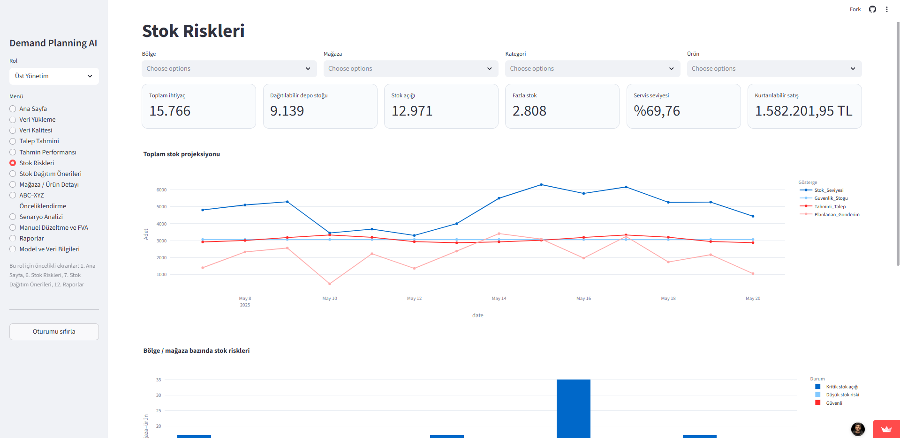

### 7. Stok Dağıtım Önerileri

**Amaç:** Mevcut stok planını önerilen planla karşılaştırmak ve açığı olan
mağazalara uygulanabilir transfer listesi üretmek.

**Ne gösterir?**

- Mevcut plan ve önerilen plan KPI karşılaştırması
- Kaynak depo/mağaza, hedef mağaza, ürün, miktar ve son tarih
- Transferle korunabilecek satış ve satış değeri
- En yüksek ticari etkiye sahip transferler
- Operasyon ekibinin ele alması gereken karar listesi

**Nasıl yorumlanır?**

- Önce/sonra grafiğinde servis seviyesi yükselirken kayıp talep düşmelidir.
- Aynı ürünün fazla bulunduğu mağaza, açık bulunan mağaza için transfer kaynağı
  olabilir; dağıtılabilir depo stoğu varsa öncelikle depo tahsisi değerlendirilir.
- Öneri otomatik sevkiyat emri değildir. Son tarih, fiziksel transfer süresi,
  mağaza kapasitesi ve operasyon maliyeti doğrulanmalıdır.
- Korunan satış değeri yüksek transferler ilk sırada ele alınmalıdır.

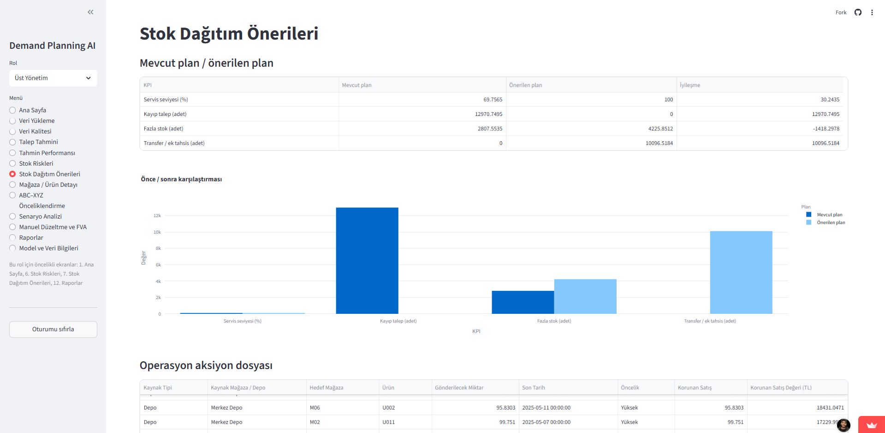

### 8. Mağaza / Ürün Detayı

**Amaç:** Toplam sonuçlardan tek bir mağaza veya ürün seviyesine inerek sorunun
kaynağını incelemek.

**Mağaza Detayı:**

- Mağazanın toplam talebi, riskli ve fazla stoklu ürün sayısı
- Gerekli ek gönderim ve servis seviyesi
- Kategori bazında tahmin ile ek gönderim karşılaştırması

**Ürün Detayı:**

- Ürünün toplam talebi, stoku, riskli mağaza sayısı ve ek gönderim ihtiyacı
- Mağazaların talep–stok matrisi
- Bölge bazında talep, stok ve ek gönderim karşılaştırması

**Nasıl yorumlanır?**

Ürün görünümündeki talep–stok matrisinde yüksek talep/düşük stok bölgesindeki
mağazalar önceliklidir. Balon büyüklüğü önerilen ek gönderimi, renk ise plan
durumunu gösterir. Mağaza görünümü, aynı mağazada birden fazla ürün riskinin
operasyonel yoğunluk oluşturup oluşturmadığını gösterir.


### 9. ABC–XYZ Önceliklendirme

**Amaç:** Ürünlerin ekonomik önemini tahmin edilebilirlikle birleştirerek insan
inceleme eforunu doğru yere yönlendirmek.

**ABC sınıfları:**

- **A:** Kümülatif ticari değerin yaklaşık ilk %80'ini oluşturan ürünler
- **B:** Sonraki yaklaşık %15'lik değer grubu
- **C:** Kalan yaklaşık %5'lik değer grubu

**XYZ sınıfları:**

- **X:** Görece daha öngörülebilir ve istikrarlı seriler
- **Y:** Orta düzey tahmin riski taşıyan seriler
- **Z:** Yüksek hata, oynaklık, sıfır satış, kesikli talep veya stokout etkisi
  nedeniyle daha zor tahmin edilen seriler

**Nasıl yorumlanır?**

- **AX:** Yüksek değerli ve öngörülebilir; otomatik planlamaya en uygun grup.
- **AZ:** Yüksek değerli ve zor tahmin edilir; en yüksek insan inceleme önceliği.
- **BZ:** Orta değerli ancak oynak; istisna bazlı kontrol edilmelidir.
- **CX/CY:** Düşük dokunuşlu veya otomatik yönetim için uygundur.
- **CZ:** Zor tahmin edilir ancak ekonomik etkisi düşüktür; sınırlı manuel efor
  ayrılmalıdır.

Dağılım grafiği portföy yapısını, saçılım grafiği ise öngörülemezlik riski ile
kayıp satış etkisinin birlikte yükseldiği serileri gösterir.

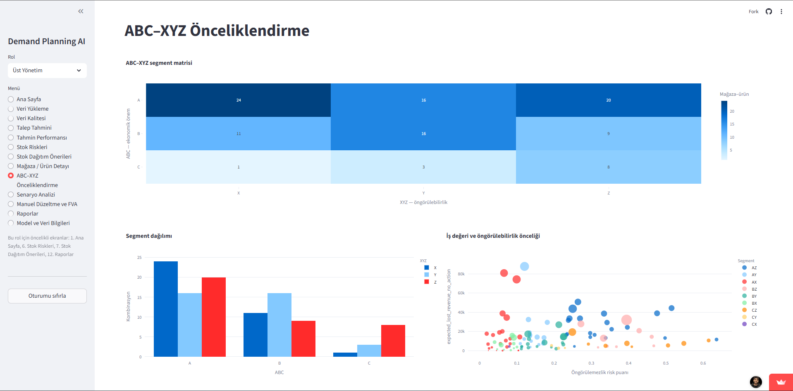

### 10. Senaryo Analizi

**Amaç:** Talep veya tedarik koşulları değiştiğinde mevcut planın ne kadar
dayanıklı olduğunu test etmek.

**Değiştirilebilen varsayımlar:**

- Talep artışı veya azalışı
- Gelen stok miktarındaki değişim
- Tedarik gecikmesi
- Minimum servis seviyesi
- Güvenlik stoğu dönemi

Uygulama mevcut planı, dengeli dağıtımı, yüksek servis yaklaşımını ve kullanıcı
tarafından oluşturulan özel senaryoyu karşılaştırır.

**Nasıl yorumlanır?**

- Talep artarken servis seviyesi hızla düşüyorsa plan talep şokuna dayanıklı
  değildir.
- Küçük bir tedarik gecikmesi büyük kayıp talep oluşturuyorsa sevkiyat
  zamanlaması kritik bir bağımlılıktır.
- Güvenlik stoğunu yükseltmek servis seviyesini artırabilir; ancak fazla stok ve
  ek sevkiyat maliyetini de yükseltir.
- Senaryo sonuçları mevcut planı otomatik değiştirmez; karar öncesi karşılaştırma
  sağlar.

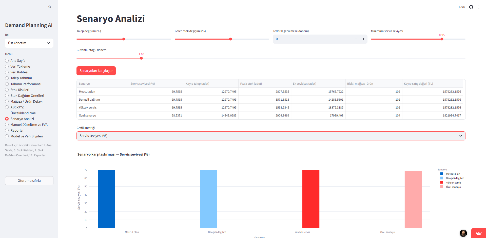

### 11. Manuel Düzeltme ve FVA

**Amaç:** Model tahminine planlamacı veya satış ekibi bilgisini eklemek ve bu
müdahalenin gerçekten değer üretip üretmediğini ölçmek.

**Tahmin sürümleri:**

- Naïve tahmin
- Model tahmini
- Planlamacı tahmini
- Satış ekibi tahmini
- Onaylanmış tahmin

Değişiklik nedeni, yorum, değiştiren kişi ve zaman bilgisi tahmin yönetişimi
için kaydedilir. Tahmin dönemi tamamlandığında gerçekleşen satış dosyası
yüklenerek Forecast Value Added (FVA) hesaplanır.

**Nasıl yorumlanır?**

- Pozitif FVA, ilgili aşamanın önceki tahmin aşamasına göre hatayı azalttığını
  gösterir.
- Negatif FVA, manuel müdahalenin tahmini kötüleştirdiğini gösterir.
- Sürekli negatif FVA üreten müdahale türleri azaltılmalı veya onay sürecine
  bağlanmalıdır.
- Gerçekleşen satışlar yüklenmeden FVA hesaplanamaz.

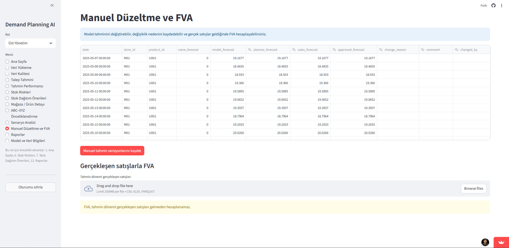

### 12. Raporlar ve Dışa Aktarım

**Amaç:** Yönetim, operasyon ve veri bilimi ekipleri için aynı analizden farklı
ayrıntı seviyelerinde çıktı üretmek.

**Çıktılar:**

- **Yönetim özeti HTML:** Ana KPI'lar, en önemli riskler ve fırsatlar
- **Operasyon Excel'i:** Transfer ve ek sevkiyat aksiyonları
- **Analitik ZIP:** Model metrikleri, gelecek tahminleri, stok projeksiyonu,
  risk skorları, transferler, ABC–XYZ ve tahmin sürümleri

Her raporda veri kesim tarihi, tahmin oluşturma tarihi, tahmin ufku, model
bilgisi, veri versiyonu ve manuel düzenleme durumu yer alır. Bu alanlar farklı
tahmin çalışmalarının karşılaştırılması ve denetlenmesi için korunmalıdır.

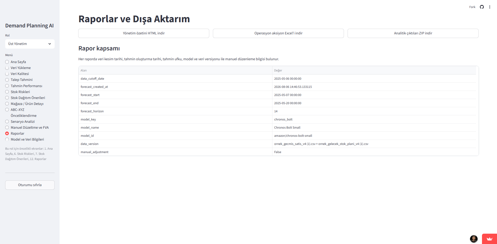

### 13. Model ve Veri Bilgileri

**Amaç:** Üretilen sonucun hangi veri, model ve ayarlarla oluşturulduğunu
izlenebilir hale getirmek.

**Ne gösterir?**

- Geçmiş ve gelecek veri tarih aralıkları
- Tahmin ufku, frekans, mağaza ve ürün kapsamı
- Stok zamanlaması ve veri versiyonu
- Kullanılabilir zero-shot model kataloğu
- Çalıştırılan model, model kimliği ve tahmin oluşturma zamanı

**Nasıl yorumlanır?**

Bu sayfa model performansından çok tekrar üretilebilirlik ve denetim içindir.
İki analiz karşılaştırılırken önce veri kesim tarihi, tahmin ufku ve model
versiyonunun aynı olup olmadığı kontrol edilmelidir. Naïve ve hareketli ortalama
yöntemleri final model değil, benchmarktır.

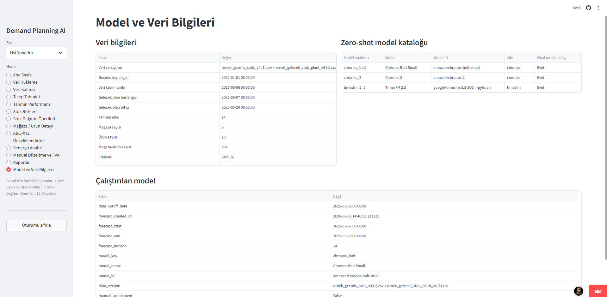

## Temel KPI sözlüğü

| KPI | Tanım | İstenen yön |
|---|---|---|
| WMAPE | Toplam mutlak hatanın toplam gerçek talebe oranı | Düşük |
| Bias | Toplam tahmin sapmasının gerçek talebe oranı | Sıfıra yakın |
| MAE | Ortalama mutlak tahmin hatası | Düşük |
| RMSE | Büyük hataları daha fazla cezalandıran hata metriği | Düşük |
| Benchmark iyileşmesi | Modelin en iyi basit yönteme göre hata iyileşmesi | Pozitif/yüksek |
| Servis seviyesi | Karşılanan talebin tahmin edilen talebe oranı | Hedefe yakın/yüksek |
| Karşılanamayan talep | Stok yetersizliği nedeniyle satışa dönüşemeyen tahmin | Düşük |
| Önerilen ek gönderim | Servis ve güvenlik stoğu hedefi için gereken ilave miktar | Bağlama göre |
| Fazla stok | Plan sonunda güvenlik stoğunun üzerinde kalan fazla miktar | Düşük |
| Kayıp satış riski | Karşılanamayan talebin fiyatla parasal karşılığı | Düşük |
| FVA | Bir tahmin aşamasının önceki aşamaya eklediği doğruluk değeri | Pozitif |

## Örnek veri ve görseller

Repoda doğrudan çalıştırılabilen iki örnek veri bulunur:

- `ornek_gecmis_satis_v4.csv`
- `ornek_gelecek_stok_plani_v4.csv`

### Örnek geçmiş satış görünümü

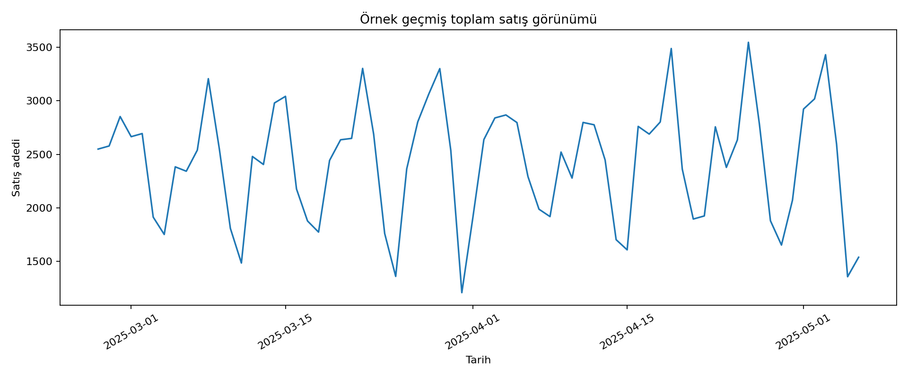

### Örnek gelecek stok dağıtım planı

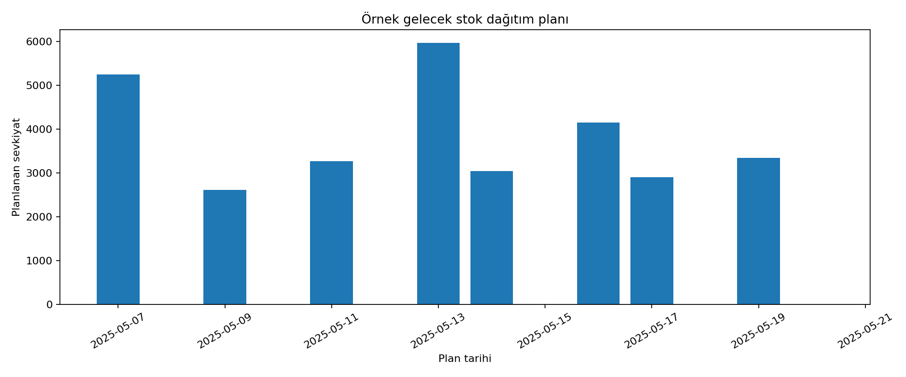

### Geçmiş veri zorunlu alanları

- Tarih
- Mağaza ID
- Ürün ID
- Satılan miktar
- Stok

Fiyat, promosyon, gelen stok, tedarik süresi, kategori, bölge, maliyet,
stokout, iade ve yeni ürün bilgileri opsiyoneldir.

### Gelecek plan zorunlu alanları

- Tarih
- Mağaza ID
- Ürün ID
- Başlangıç/mevcut stok
- Planlanan gönderim

Beklenen giriş tarihi, dağıtılabilir depo stoğu, mağaza kapasitesi ve plan dönemi
fiyatı opsiyoneldir.

> Büyük veya gizli şirket verilerini repoya yüklemeyin. Hassas verileri
> `.gitignore` kapsamındaki `data/raw/` dizininde tutun.

## Kullanılan modeller

Final tahmin adayları:

- Amazon Chronos Bolt Small
- Amazon Chronos 2
- TimesFM 2.5 — opsiyonel

Benchmarklar:

- Geçen dönem değeri
- Sezonsal naïve
- Hareketli ortalama

## Kurulum

Önerilen Python sürümü: **3.11**

```bash
git clone GITHUB_REPO_LINKINI_BURAYA_EKLE
cd Demand-Planning
python -m venv .venv
```

Windows:

```bash
.venv\Scripts\activate
```

macOS / Linux:

```bash
source .venv/bin/activate
```

Bağımlılıkları yükleyin:

```bash
python -m pip install --upgrade pip
pip install -r requirements.txt
```

Uygulamayı çalıştırın:

```bash
streamlit run app.py
```

Tarayıcıda varsayılan olarak `http://localhost:8501` açılır. İlk gerçek tahmin
çalıştırmasında model ağırlıkları indirileceği için işlem daha uzun sürebilir.

## TimesFM kurulumu

TimesFM, Streamlit Community Cloud başlangıcını ve bellek kullanımını
ağırlaştırabileceği için ayrı tutulmuştur:

```bash
pip install -r requirements-timesfm.txt
```

Kurulduğunda uygulamadaki model listesinde otomatik görünür.

## Hızlı test

Model indirmeden repo yapısını, örnek dosyaları ve secret taramasını kontrol edin:

```bash
python scripts/validate_repository.py
python -m compileall -q .
```

## Streamlit Community Cloud dağıtımı

1. Repoyu GitHub'a public olarak push edin.
2. Streamlit Community Cloud'da **Create app** seçin.
3. Repository ve `main` branch'ini seçin.
4. Main file path olarak `app.py` girin.
5. Python 3.11 kullanın.
6. Deploy sonrası Cloud logs ekranını kontrol edin.

TimesFM zorunlu değilse `requirements.txt` dosyasına eklemeyin; ayrı
`requirements-timesfm.txt` dosyası yerel veya daha güçlü ortamlarda kullanılabilir.

## Ortam değişkenleri ve güvenlik

Bu MVP varsayılan olarak API anahtarı gerektirmez.

```bash
cp .env.example .env
```

- `.env`, `.env.*` ve `.streamlit/secrets.toml` repoya girmez.
- Gerçek token veya şifreyi `.env.example` içine yazmayın.
- Daha önce bir anahtar push edildiyse dosyayı silmek yeterli değildir; anahtarı
  sağlayıcı panelinden iptal edip yenisini oluşturun.
- Ayrıntılar için `SECURITY.md` dosyasına bakın.

## Proje yapısı

```text
.
├── app.py
├── enterprise_analytics.py
├── demand_business_analytics_fixed.py
├── zero_shot_demand_mvp_core_generic_v2.py
├── requirements.txt
├── requirements-timesfm.txt
├── ornek_gecmis_satis_v4.csv
├── ornek_gelecek_stok_plani_v4.csv
├── docs/
│   └── screenshots/
├── scripts/
│   └── validate_repository.py
├── .github/
│   └── workflows/
│       └── ci.yml
├── .streamlit/
│   └── config.toml
├── .env.example
├── .gitignore
├── ARCHITECTURE.md
├── SECURITY.md
└── LICENSE
```

## Sınırlamalar

- Streamlit oturum verileri kalıcı veritabanında tutulmaz.
- Kurumsal rol ve yetki kontrolü uygulanmamıştır.
- Gerçek FVA için tahmin döneminin gerçekleşen satışları yüklenmelidir.
- Güvenlik stoğu hesabı basit dönem talebi çarpanıdır; talep varyansı ve tedarik
  süresi dağılımına dayalı istatistiksel bir optimizasyon değildir.
- Model indirme ve tahmin süresi kullanılan donanıma göre değişir.
- Tahmin ve transfer önerileri karar desteğidir; otomatik sipariş veya sevkiyat
  emri oluşturmaz.

## Lisans

MIT — `LICENSE`
